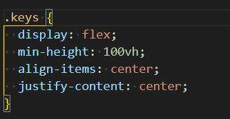

#主题
实现页面击鼓效果，页面有对应按键的显示元素，用户在键盘按下按键，计算机发出对应的乐器声，对应的显示元素改变状态

#实现逻辑
1. HTML创建按键对应的显示元素和播放音频，自定义data-key属性，属性值为对应按键的keyCode，实现与键盘按键的关联。
2. 添加键盘按键事件监听器，通过事件对象的keyCode，获取对应DOM元素并进行操作

#学到的东西
##flex布局实现垂直水平居中

##CSS过渡完成事件(transitioned)
1. 事件对象的propertyName属性保存触发事件的CSS属性
2. 如果一个元素有多个过渡效果，会触发多次transitioned事件